# 🔐 Active Directory Security Lab

A hands-on Active Directory laboratory environment built using **VMware Workstation, Windows Server 2025, and Windows 11**.

This project demonstrates the implementation of a multi-server Active Directory environment using the domain **`cyberlab.local`**, including a Primary Domain Controller (PDC), Additional Domain Controller (ADC), Read-Only Domain Controller (RODC), DNS, DHCP, Organizational Units, users and groups, domain joining, authentication, replication, and system verification.

The entire environment was created inside an isolated VMware virtual network for educational and practical cybersecurity learning.

---

## 🎯 Project Objectives

The main objectives of this project were to:

* Build an Active Directory environment using VMware
* Configure a VMware Host-Only virtual network
* Install and configure Windows Server 2025
* Deploy Active Directory Domain Services (AD DS)
* Create the `cyberlab.local` domain
* Configure a Primary Domain Controller
* Configure an Additional Domain Controller
* Configure a Read-Only Domain Controller
* Configure DNS for the Active Directory environment
* Configure DHCP for client IP address assignment
* Create Organizational Units, users, and groups
* Join a Windows 11 client to the domain
* Verify domain authentication and connectivity
* Verify Active Directory health
* Verify Active Directory replication
* Understand the communication and replication structure between domain controllers

---

## 🏗️ Lab Architecture

The laboratory uses a VMware Host-Only network named **VMnet1**.

### Active Directory Hierarchy

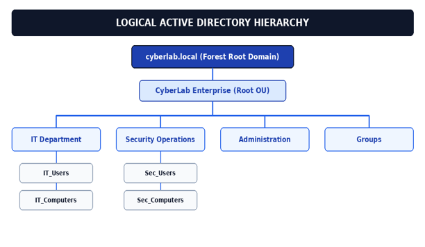

The Active Directory environment uses the domain:

```text
cyberlab.local
```

The logical hierarchy includes organizational areas such as:

* IT Department
* Security Operations
* Administration
* Groups

The Active Directory environment also contains organizational units for departments, users, computers, and servers.

### Network Topology

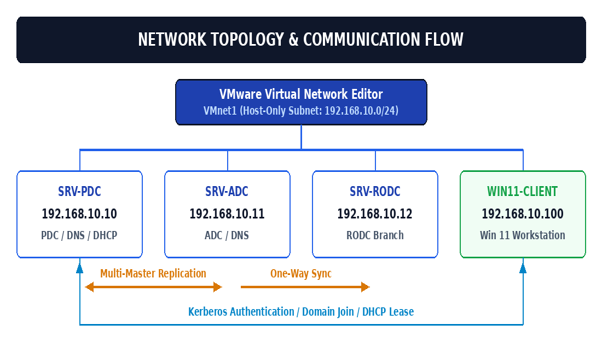

The virtual network connects the domain controllers and Windows 11 client within the VMware laboratory environment.

---

## 💻 Lab Environment

| Component               | Configuration                     |
| ----------------------- | --------------------------------- |
| Virtualization          | VMware Workstation                |
| Operating System        | Windows Server 2025               |
| Client Operating System | Windows 11                        |
| Active Directory Domain | `cyberlab.local`                  |
| Virtual Network         | VMware VMnet1                     |
| Network Type            | Host-Only                         |
| Network                 | `192.168.10.0/24`                 |
| Subnet Mask             | `255.255.255.0`                   |
| PDC                     | `SRV-PDC`                         |
| PDC IP                  | `192.168.10.10`                   |
| ADC                     | `SRV-ADC`                         |
| ADC IP                  | `192.168.10.11`                   |
| RODC                    | `SRV-RODC`                        |
| RODC IP                 | `192.168.10.12`                   |
| Windows 11 Client       | `WIN11-CLIENT`                    |
| DHCP Scope              | `192.168.10.100 – 192.168.10.200` |

---

## 🌐 VMware Network Configuration

The Active Directory environment was created on a VMware **Host-Only network**.

The configured network was:

```text
VMnet1
Network: 192.168.10.0/24
Subnet Mask: 255.255.255.0
```

This isolated virtual network allows the laboratory machines to communicate with each other without exposing the lab directly to the external network.

### Network Configuration Evidence

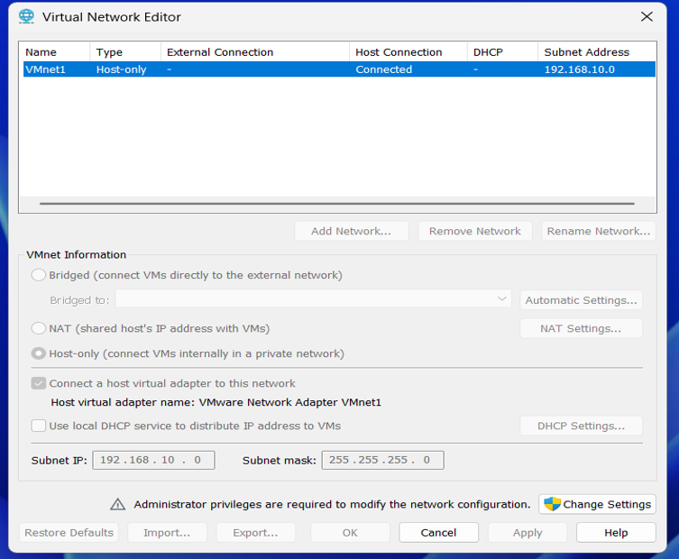

---

# 🖥️ Primary Domain Controller

The first server was configured as the Primary Domain Controller for the `cyberlab.local` domain.

### Server

```text
Hostname: SRV-PDC
IP Address: 192.168.10.10
Domain: cyberlab.local
```

Windows Server 2025 was installed and configured with a static IPv4 address before Active Directory services were deployed.

### Windows Server 2025

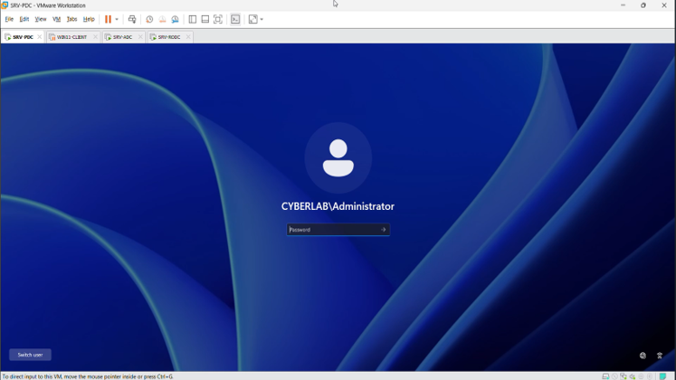

### Hostname and Domain Configuration

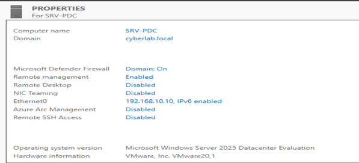

### Static IP Configuration

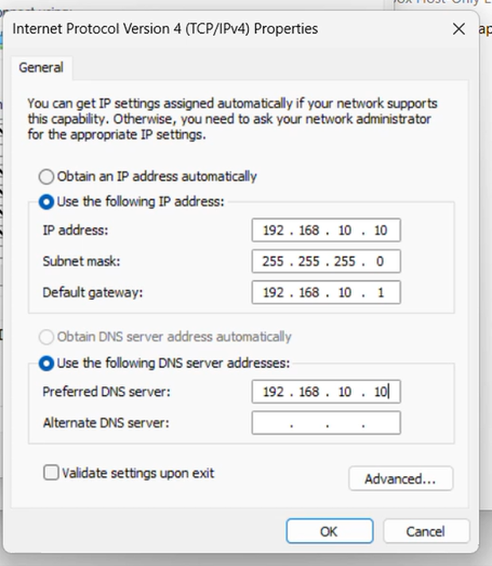

---

# 🏢 Active Directory Domain Services

Active Directory Domain Services was installed on `SRV-PDC`.

The domain created for the laboratory was:

```text
cyberlab.local
```

The AD DS configuration was verified using the Active Directory Domain Services Configuration Wizard.

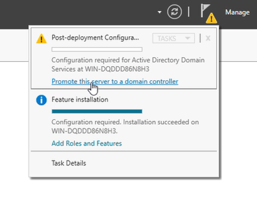

---

# 🗂️ Active Directory Organizational Structure

Active Directory Users and Computers was used to create and manage the organizational structure.

The laboratory includes Organizational Units for areas such as:

* IT
* HR
* Finance
* Computer OU
* Servers

Users and groups were provisioned within the Active Directory environment.

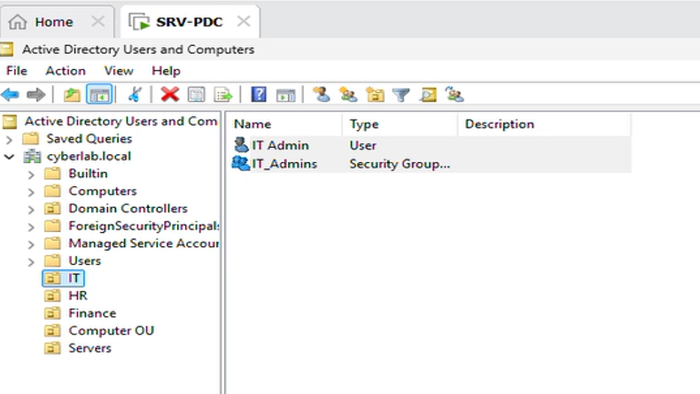

---

# 🌐 DNS and DHCP

DNS and DHCP were configured as part of the Active Directory laboratory.

## DNS

DNS provides name resolution required for the Active Directory domain.

The domain used for the lab is:

```text
cyberlab.local
```

DNS resolution was later verified from the Windows 11 client using:

```cmd
nslookup cyberlab.local
```

## DHCP

A DHCP scope named:
```text
CyberLab_Internal_Scope
```

was configured on `SRV-PDC`.

The configured address range was:

```text
192.168.10.100 – 192.168.10.200
```

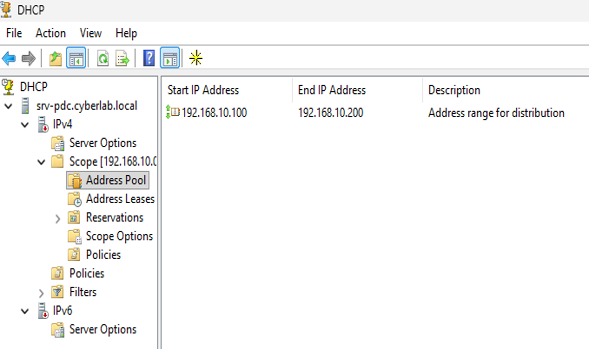

---

# 🖥️ Additional Domain Controller

A second Windows Server was configured as an Additional Domain Controller for the existing:

```text
cyberlab.local
```

### Server

```text
Hostname: SRV-ADC
IP Address: 192.168.10.11
```

Before configuring the Additional Domain Controller, connectivity with the Primary Domain Controller was verified.


The server was then configured using the AD DS Configuration Wizard with the option to:

```text
Add a domain controller to an existing domain
```

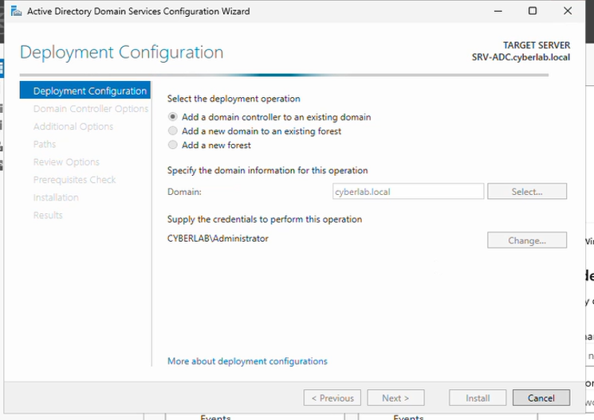

---

# 🔒 Read-Only Domain Controller

A Read-Only Domain Controller was configured as part of the Active Directory environment.

### Server

```text
Hostname: SRV-RODC
IP Address: 192.168.10.12
```

The Password Replication Policy was configured to control which accounts are allowed or denied from having their credentials cached on the RODC.

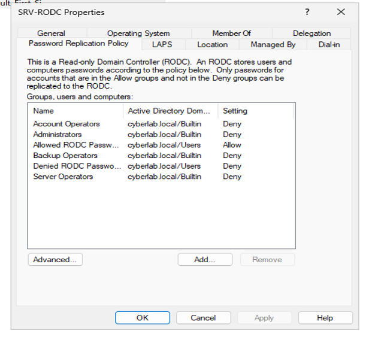

---

# 💻 Windows 11 Domain Client

A Windows 11 virtual machine was configured as the domain client.

### Client

```text
Hostname: WIN11-CLIENT
Domain: cyberlab.local
```

The client was successfully joined to the Active Directory domain.

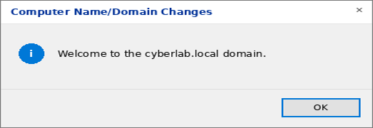

After joining the domain, the client was able to authenticate using a domain account.

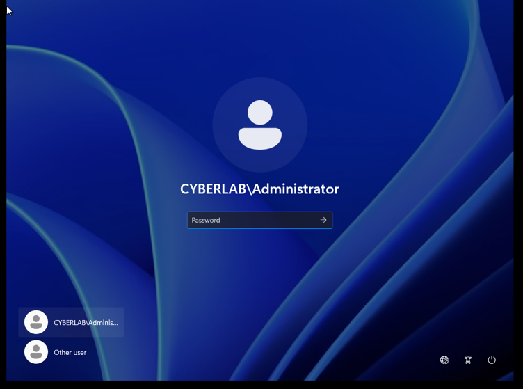

---

# 🧪 Network and Domain Verification

Multiple tests were performed to verify that the Active Directory environment was functioning correctly.

## IP Configuration and Connectivity

The Windows 11 client was checked using:

```cmd
ipconfig /all
```

Connectivity with the Primary Domain Controller was tested using:

```cmd
ping 192.168.10.10
```

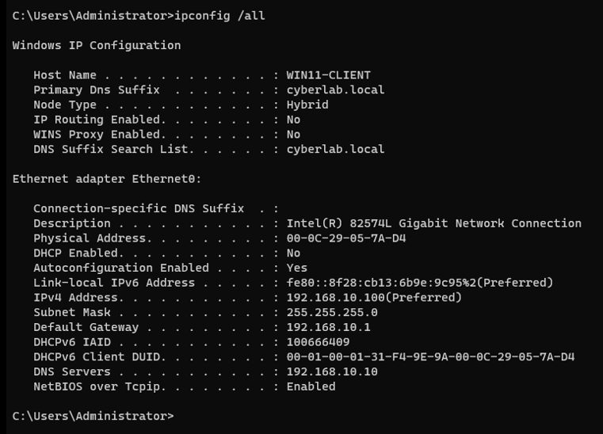

---

## DNS Resolution

DNS resolution for the Active Directory domain was tested using:

```cmd
nslookup cyberlab.local
```

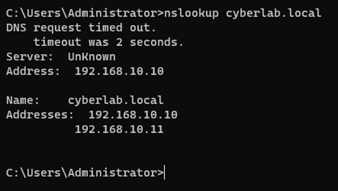

---

## Domain Authentication

The authenticated domain identity was verified using:

```cmd
whoami
```

The logon server was identified using:

```cmd
echo %logonserver%
```

The test confirmed authentication through the Active Directory environment.

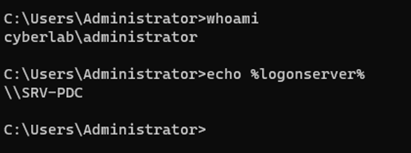

---

# 🩺 Domain Controller Health Verification

The health of the Primary Domain Controller was tested using:

```cmd
dcdiag /v
```

The diagnostic results showed successful test execution for the domain controller.

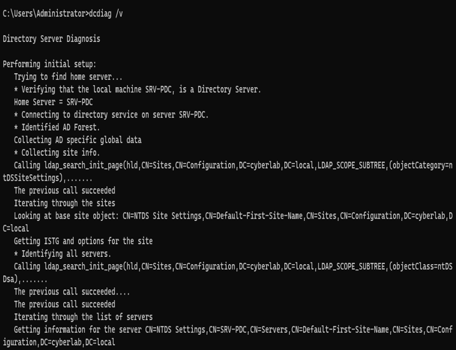

---

# 🔄 Active Directory Replication Verification

Replication between domain controllers was verified using:

```cmd
repadmin /showrepl
```

The output showed successful inbound replication relationships across the Active Directory partitions.

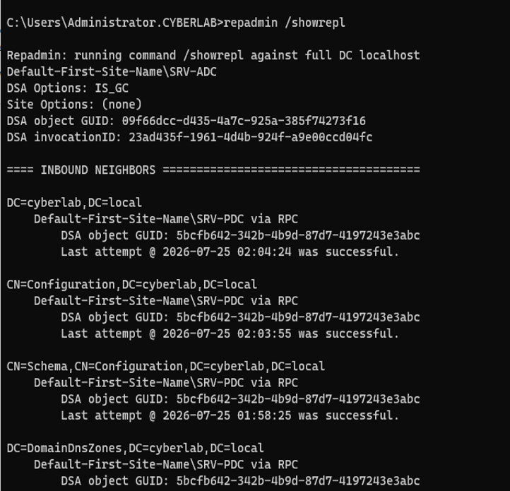

---

# 🔗 Active Directory Sites and Services

Active Directory Sites and Services was used to inspect the replication topology.

The console showed NTDS Settings and automatically generated replication connection objects between:

```text
SRV-PDC
SRV-ADC
SRV-RODC
```

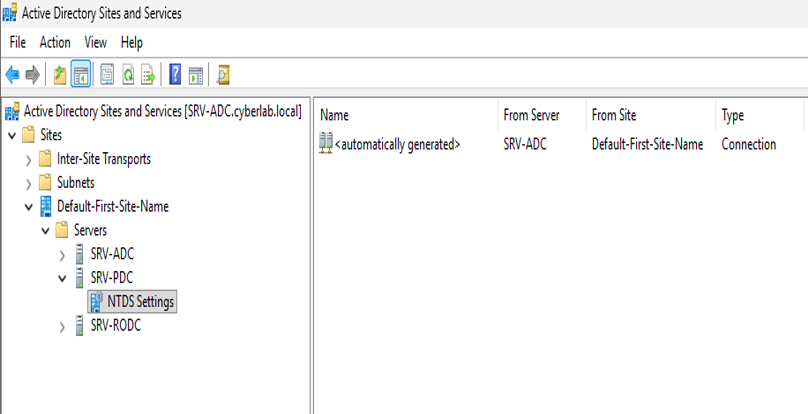

---

# 📊 Testing Summary

| Test                     | Tool / Command                      | Purpose                              |
| ------------------------ | ----------------------------------- | ------------------------------------ |
| Network configuration    | `ipconfig /all`                     | Verify IP and network settings       |
| Network connectivity     | `ping`                              | Verify communication between systems |
| DNS resolution           | `nslookup`                          | Verify `cyberlab.local` resolution   |
| Domain authentication    | `whoami`                            | Verify domain identity               |
| Logon server             | `echo %logonserver%`                | Identify the authentication server   |
| Domain Controller health | `dcdiag /v`                         | Check domain controller health       |
| AD replication           | `repadmin /showrepl`                | Verify replication                   |
| Replication topology     | Active Directory Sites and Services | Inspect replication connections      |

---

# 📸 Project Evidence

The complete project evidence is available in the repository under:

```text
screenshots/
```

The screenshots document:

* VMware network configuration
* Windows Server 2025 installation
* PDC configuration
* Static IP configuration
* Active Directory Domain Services
* DHCP configuration
* Active Directory users and organizational structure
* ADC configuration
* RODC Password Replication Policy
* Windows 11 domain joining
* Domain authentication
* DNS resolution
* Domain Controller diagnostics
* Active Directory replication
* Active Directory Sites and Services

---

# 🧠 Key Skills Demonstrated

This project provided hands-on experience with:

* VMware Workstation
* Windows Server 2025
* Windows 11
* Active Directory Domain Services
* Domain Controller configuration
* Active Directory Users and Computers
* Organizational Units
* User and group management
* DNS
* DHCP
* Primary Domain Controller
* Additional Domain Controller
* Read-Only Domain Controller
* Password Replication Policy
* Domain joining
* Windows domain authentication
* Active Directory replication
* Active Directory Sites and Services
* Network troubleshooting
* Domain Controller health diagnostics

---

# 📚 What I Learned

Through this laboratory project, I developed practical understanding of how an enterprise-style Windows domain environment can be deployed and managed.

The project helped me understand the relationship between **DNS, DHCP, Active Directory, Domain Controllers, Windows clients, authentication, and replication**.

I also gained practical experience troubleshooting network connectivity and validating Active Directory functionality using built-in Windows tools and commands.

---

# 🔮 Future Improvements

Possible future additions to this laboratory include:

* Active Directory security auditing
* Windows event log monitoring
* SIEM integration
* PowerShell-based administration
* Advanced Active Directory security testing
* Security monitoring and detection scenarios
* Vulnerability assessment of the laboratory environment

---

# 👩‍💻 Author

**Neha**

B.Sc. IT | Cybersecurity & Ethical Hacking

Areas of interest:

* Cybersecurity
* Ethical Hacking
* SOC Operations
* Network Security
* Active Directory Security
* Cloud Security

---

## ⚠️ Disclaimer

This project was created for educational purposes inside a controlled virtual laboratory environment.

All testing and security experimentation should be performed only on systems for which you have permission or authorization.
